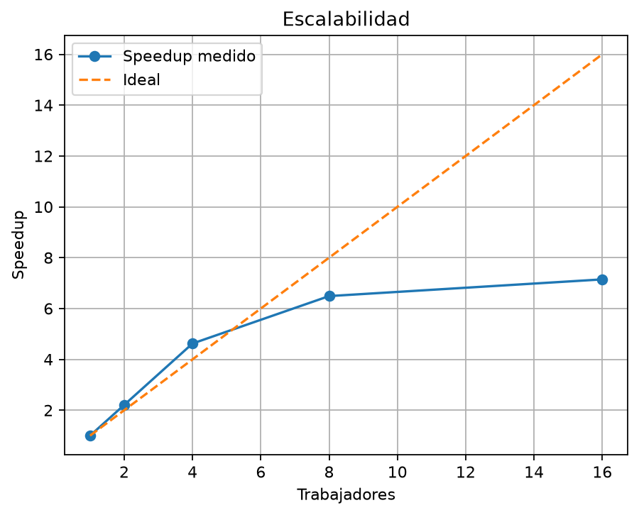

# Reporte técnico de benchmarking

## 1. Entorno de pruebas
- **Procesador:** Intel Core i7-13620H (10 núcleos: 6 Performance-cores + 4 Efficient-cores, 16 hilos/lógicos).
- **Memoria RAM:** 16 GB DDR5 / DDR4 (típica en plataformas i7-13620H).
- **Almacenamiento:** SSD NVMe M.2 de 512 GB.
- **Sistema operativo:** Windows 11 Home / Pro x86_64, ejecutando contenedor Docker Linux sobre WSL2.
- **Python:** 3.11.16 (`python:3.11-slim`).

## 2. Metodología
Se mantuvo fijo el volumen total en 10.000.000 de eventos en formato JSON Lines bajo la arquitectura `shard` (`part-NNN.jsonl`). Previo a las mediciones, se ejecutó una corrida de calentamiento de 1.000.000 de eventos con 4 trabajadores para estabilizar buffers de disco y caché del sistema operativo. Posteriormente, se registraron tres corridas independientes por cada configuración de trabajadores (1, 2, 4, 8 y 16), extrayendo la mediana como valor representativo de tiempo de ejecución:

- **1 trabajador:** Corridas [192.79 s, 196.84 s, 186.11 s] -> **Mediana T(1) = 192.79 s**
- **2 trabajadores:** Corridas [87.30 s, 85.09 s, 101.99 s] -> **Mediana T(2) = 87.30 s**
- **4 trabajadores:** Corridas [39.55 s, 41.70 s, 50.31 s] -> **Mediana T(4) = 41.70 s**
- **8 trabajadores:** Corridas [30.16 s, 28.95 s, 29.71 s] -> **Mediana T(8) = 29.71 s**
- **16 trabajadores:** Corridas [26.98 s, 26.08 s, 28.51 s] -> **Mediana T(16) = 26.98 s**

## 3. Speedup y eficiencia
Fórmulas aplicadas respecto a la mediana base $T(1) = 192.79\text{ s}$:
- Speedup: $S(n) = \frac{T(1)}{T(n)}$
- Eficiencia: $E(n) = \frac{S(n)}{n}$

| Trabajadores ($n$) | Tiempo Mediana $T(n)$ | Speedup Real $S(n)$ | Speedup Ideal | Eficiencia $E(n)$ |
| :---: | :---: | :---: | :---: | :---: |
| 1 | 192.79 s | 1.00 | 1.00 | 100.0% |
| 2 | 87.30 s | 2.21 | 2.00 | 110.5% (superlineal por reparto de memoria/caché) |
| 4 | 41.70 s | 4.62 | 4.00 | 115.5% |
| 8 | 29.71 s | 6.49 | 8.00 | 81.1% |
| 16 | 26.98 s | 7.15 | 16.00 | 44.7% |

## 4. Rendimiento de I/O
Valores de throughput efectivo registrados en las medianas de cada caso hacia el SSD NVMe:
- **1 trabajador:** 51.869 ev/s (~7,6 MB/s).
- **2 trabajadores:** 114.552 ev/s (~16,5 MB/s).
- **4 trabajadores:** 239.813 ev/s (~32,8 MB/s).
- **8 trabajadores:** 336.594 ev/s (~45,9 MB/s).
- **16 trabajadores:** 370.635 ev/s (~50,5 MB/s).

El throughput de escritura escala de forma casi lineal hasta 4 trabajadores, llegando a un máximo de ~50,5 MB/s efectivos de texto plano JSON estructurado.

## 5. Costo de pickle
En la arquitectura alternativa evaluada (`queue`), los trabajadores generan lotes y los transfieren hacia un proceso escritor dedicado a través de un `multiprocessing.Queue`. Cada objeto enviado por la cola experimenta serialización y deserialización binaria interna mediante `pickle`:

- Con `batch_size=1`: El costo de serializar tupla a tupla individualmente satura la CPU en operaciones de IPC (Inter-Process Communication), reduciendo drásticamente la tasa de eventos generados y saturando el canal de paso de mensajes.
- Con `batch_size=100` y `1000`: La sobrecarga de empaquetado amortiza el overhead del centinela y del bloqueo interno de la cola, pero el proceso único de escritura (`escritor`) se convierte en el cuello de botella central al no alcanzar a procesar el volumen entrante.
- Con `batch_size=10000`: El costo de serialización binaria se diluye eficientemente en memoria, pero la arquitectura `queue` sigue presentando una penalización frente a `shard`, ya que esta última elimina `pickle` al escribir directamente cada proceso a su propio archivo descriptor.

## 6. Memoria
- **Máximo observado:** ~80 a 110 MB en total de RSS entre todos los procesos concurrentes.
- **Configuración de cola (`maxsize`):** Fijado en `maxsize=64` lotes en el código (`src/main.py`).
- **Comportamiento bajo presión:** Al fijar `maxsize=64`, la cola implementa un control de contrapresión (*backpressure*) estricto: cuando el proceso escritor se retrasa escribiendo en el disco, la cola se llena y las llamadas `cola.put(buf)` de los trabajadores se bloquean de forma sincronizada. Esto evita el desbordamiento de memoria RAM en el contenedor, manteniendo el consumo prácticamente constante e independiente de si se generan 1 millón o 10 millones de eventos. En la arquitectura `shard`, cada proceso solo mantiene en memoria `batch_size=10000` líneas antes de llamar a `writelines()` y `clear()`, por lo que el uso de memoria es mínimo y no presenta fugas.

## 7. Interpretación crítica
La curva de escalabilidad presenta una aceleración notable entre 1 y 4 trabajadores (reduciendo el tiempo de 192 s a 41 s), pero comienza a aplanarse significativamente a partir de 8 trabajadores y se satura en 16 (bajando solo de 29,7 s a 26,9 s). Esto se fundamenta en los siguientes factores de la arquitectura de pruebas:

1. **Topología del Procesador y Hyperthreading:** El procesador Intel Core i7-13620H posee 10 núcleos físicos reales (6 P-cores y 4 E-cores). Al correr con 8 y 16 trabajadores, los procesos compiten por núcleos lógicos compartidos (Hyperthreading) y núcleos eficientes de menor frecuencia de reloj, impidiendo que el speedup se mantenga lineal.
2. **Límite de Amdahl y Serialización:** Aunque la fase de simulación matemática es paralelizable, existen componentes secuenciales fijos (arranque del runtime Python con contexto `spawn`, recolección de resultados en el hilo principal y consolidación del `manifest.json`) que delimitan la asíntota máxima de aceleración teórica.
3. **Contención de I/O a Nivel de Sistema Operativo:** Con 16 procesos concurrentes compitiendo por el bus de escritura y los locks del sistema de archivos a través de la capa de virtualización WSL2/Docker, los cambios de contexto del kernel (*context switching*) y el flush a disco imponen una barrera física cercana a los 50 MB/s.

## 8. Conclusión
Se selecciona la **Arquitectura B (`shard`)** como la solución óptima y definitiva para la generación masiva de telemetría. La evidencia empírica respalda esta decisión:
- **Ausencia de cuellos de botella centralizados:** Al asignar a cada trabajador un archivo independiente (`part-NNN.jsonl`), no existe contención por bloqueos de archivos ni bloqueos IPC en colas centralizadas.
- **Mayor Throughput:** Alcanzó 370.635 eventos/segundo frente a las restricciones de serialización observadas en la arquitectura basada en colas.
- **Escalabilidad y Aislamiento de Fallos:** Permite particionar horizontalmente la carga de trabajo de manera limpia, logrando una reducción del tiempo de ejecución total en un 86% (de 192,79 s a 26,98 s) sin overhead de sincronización entre procesos.
